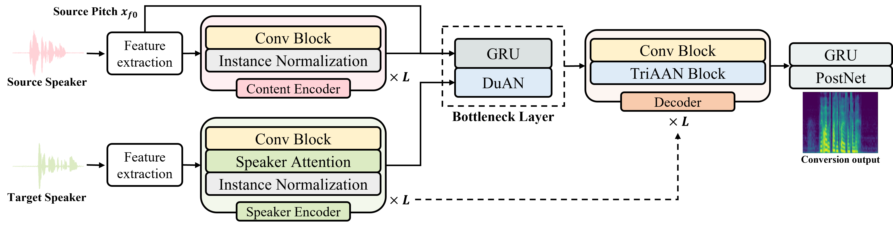

# TriAAN-VC: Triple Adaptive Attention Normalization for any-to-any Voice Conversion (ICASSP 2023)

This is a Pytorch implementation of [MANNER: Multi-view Attention Network for Noise ERasure](https://arxiv.org/abs/2203.02181). MANNER is a deep learning model for speech enhancement in time-domain. MANNER consists of encoder-decoder based on U-net. Each encoder and decoder contains Up/Down conv, Residual Conformer block, and Multi-view Attention block. MANNER representing full information of the signal efficiently addresses channel and long sequential features. Experimental results on the VoiceBank-DEMAND dataset suggest that MANNER achieves state-of-the-art performance. In addition, among time-domain models, MANNER shows efficient results in terms of inference speed and memory usage.

The overall architecture of TriAAN-VC is as below:

<p align="center">
	
</p>

# Installation & Enviornment

The OS, Python, and PyTorch version are as below (You can also use other versions.):
- Windows
- Linux
- python == 3.8
- pytorch == 1.9.1
- torchaudio == 0.9.1

You can install requirements through git and requirements.txt except for pytorch and torchaudio.
```C
git clone https://github.com/winddori2002/TriAAN-VC.git
cd TriAAN-VC
pip install -r requirements.txt
```

# Prepare for usage

## 1. Prepare dataset

We use VoiceBank-DEMAND (Valentini) dataset consisting of 28 speakers for training MANNER. 

- The dataset can be downloaded [here](https://datashare.ed.ac.uk/handle/10283/2791).
- We use [282,287] speakers as validation set.

## 2. Downsample

The sample rate of the dataset is 48kHz.

For a fair comparison, we downsample the audio files from 48kHz to 16kHz.

- To downsample the audio, run the following code and edit the directories.

```
python downsampling.py
```
  
- In the ```downsampleing.py``` script, you should change the contents as follows.
  
```
downsample_rate  = 16000
clean_train_path = 'The original clean trainset path'
noisy_train_path = 'The original noisy trainset path'
clean_test_path  = 'The original clean testset path'
noisy_test_path  = 'The original noisy testset path'
resample_path    = 'Resampled path'
```
  
## 3. Make data path files

We make json file consisting of the audio path for loading data efficiently. Train (clean, noisy) and 
Test (clean, noisy): four json files need to be generated for training. 

The json files will be generated in ```./data_path```.

Notice that the data is downsampled.

- To make json file, run the following code and edit the directories.

```
python make_datapath.py
```

- In the ```make_datapath.py```, you should change the contents as follows.

```
clean_train_path = 'The resampled clean trainset path'
noisy_train_path = 'The resampled noisy trainset path'
clean_test_path  = 'The resampled clean testset path'
noisy_test_path  = 'The resampled noisy testset path'
```

# How to use

## 1. Train

### Training with default settings

You can train MANNER with the default setting by running the following code.

```
python main.py train --aug True --aug_type tempo
```

### Training with other arguments
If you want to edit model settings, you can run the following code with other arguments. 

In ```config.py```, you can find other arguments, such as batch size, epoch, and so on.

```
python main.py train --hidden 60 --depth 4 --growth 2 --kernel_size 8 --stride 4 --segment_len 64 --aug True --aug_type tempo

MANNER arguments:
  --in_channels : initial in channel size (default:1)
  --out_channels: initial out channel size (default:1)
  --hidden      : channel size to expand (default:60)
  --depth       : number of layers for encoder and decoder (default:4)
  --kernel_size : kernel size for UP/DOWN conv (default:8)
  --stride      : stride for UP/DOWN conv (default:4)
  --growth      : channel expansion ration (default:2)
  --head        : number of head for global attention (default:1)
  --segment_len : chunk size for overlapped chunking in a dual-path processing (default:64)
  
Setting arguments:
  --sample_rate: sample_rate (default:16000)
  --segment    : segment the audio signal with seconds (default:4)
  --set_stride : Overlapped seconds when segment the signal (default:1)
  
Augmentation arguments:
  --aug     : True/False 
  --aug_type: augmentation type (tempo, speed, shift available. only shift available on Windows.)
```

### Training with logging

The logs are uploaded on [neptune.ai](https://neptune.ai/)
```
python main.py train --logging True --logging_cut -1

Logging arguments:
  --logging    : True/False
  --logging_cut: log after epochs when the epoch is bigger than logging_cut
```

## 2. evaluation

After training, you can evaluate the model in terms of PESQ and STOI by running the code below.
You need to keep the model arguments in the training phase.
```
python main.py test --save_enhanced True --enhanced_path []

evaluation arguments:
  --save_enhanced: saving enhanced audio file
  --enhanced_path: enhanced file directory
```

If you want to evaluate with all measures (PESQ, STOI, CSIG, CBAK, COVL), run the following code.
```
python eval_measure.py

clean_path    = 'test clean path'
enhanced_path = 'enhanced path'
```


## 3. Pretrained weights

The pretrained weights of MANNER is uploaded on the github release [here](https://github.com/winddori2002/MANNER/releases/tag/v1.0)


## 4. MANNER small

For MANNER (small), it is necessary to change the code in ```./model.py``` since it has a different structure from MANNER (base). The code for MANNER (small) is commented below the line for MANNER in  ```./model.py```.

## 5. Custom enhancement

For custom enhancement, you can estimate enhanced speech by running code with ```custom_enhance.py```. 
The codes include input data processing (downsample from 48 kHz to 16 kHz).
```
python custom_enhance.py

enhance arguments:
  --device: Cuda device or CPU
  --noisy_path: Path (folder) which contains noisy wav files
  --model_name: Model version (small, base, large) - you can use one of them
```


## 6. Enhanced samples

We provide randomly selected audio sample pairs in ```./samples```.  Each pair is composed of enhanced speech and noisy speech. We tried to choose some pairs containing more noises.

# Experimental Results

The experimental results and parameter settings of MANNER versions are as below.

|Model|hidden|depth|kernel size|stride|
|:---:|:---:|:---:|:---:|:---:|
|MANNER (small)|60|4|8|4|
|MANNER|60|4|8|4|
|MANNER (Large)|120|4|8|4|

|Model|PESQ|STOI|CSIG|CBAK|COVL|
|:---:|:---:|:---:|:---:|:---:|:---:|
|MANNER (small)|3.12|95|4.45|3.61|3.82|
|MANNER|3.21|95|4.53|3.65|3.91|
|MANNER (Large)|3.24|95|4.55|3.66|3.94|

## Citation

```
@inproceedings{park2022manner,
  title={MANNER: Multi-View Attention Network For Noise Erasure},
  author={Park, Hyun Joon and Kang, Byung Ha and Shin, Wooseok and Kim, Jin Sob and Han, Sung Won},
  booktitle={ICASSP 2022-2022 IEEE International Conference on Acoustics, Speech and Signal Processing (ICASSP)},
  pages={7842--7846},
  year={2022},
  organization={IEEE}
}
```

## License

This repository is released under the MIT license.

The file ```src/dataset.py``` was adapted from the [facebookresearch/denoiser](https://github.com/facebookresearch/denoiser), released under the CC-BY-NC 4.0. license. We modified the speaker selection in the dataset. The ```src/metrics.py``` was adapted from the [facebookresearch/denoiser](https://github.com/facebookresearch/denoiser) and [santi-pdp/segan_pytorch](https://github.com/santi-pdp/segan_pytorch), where latter was released under the MIT license. The ```src/stft_loss.py``` was adapted from the [facebookresearch/denoiser](https://github.com/facebookresearch/denoiser) and [kan-bayashi/ParallelWaveGAN](https://github.com/kan-bayashi/ParallelWaveGAN), where latter was released under the MIT license.
